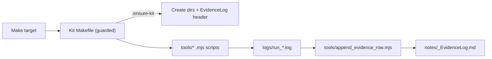

# Research & Learning Kits — Node-first (with optional Python)

This repository provides a **repeatable workspace** for research and learning projects:

- **Learning lane (JS + optional Python):** run small demos/tests, log outputs, and evolve code artifacts.
- **Research lane:** ingest references (books, blogs), capture/clean transcripts, and package context for ChatGPT/NotebookLM.
- **Notes lane:** maintain an Evidence Log and Smart Searches in Bear.

The design is **Makefile-first** with **functional JavaScript** utilities (no classes, no global deps).

## Quick Start

```bash
# 1) Bootstrap kits (default: PROJECT_NAME, DEMO_JS_AsyncPatterns)
node scripts/bootstrap/index.mjs

# or explicitly define kits and output directory:
node scripts/bootstrap/index.mjs --kits PROJECT_NAME,DEMO_JS_AsyncPatterns --out ./kits

# overwrite existing kits if needed
node scripts/bootstrap/index.mjs --kits PROJECT_NAME --out ./kits --force

# 2) Work in a kit
cd PROJECT_NAME_NODEONLY

# JS lane
make run-js
make watch-js
make run-tests

# Optional Python lane
make run-py
make watch-py
make run-tests-py

# Research ingests
make import-web URL="https://example.com/post" TITLE="Great Post" TAGS="nlp,llm"
make import-youtube URL="https://youtu.be/…" TITLE="…" CHANNEL="…" YEAR=2025 TAGS="video" TRANSCRIPT=0
make import-podcast FILE="assets/audio/ep.mp3" TITLE="…" AUTHORS="…" YEAR=2025 TAGS="audio"

# Transcripts
make import-transcript FILE="assets/metadata/transcripts/raw.srt" SRC="whisperx"
make transcript-clean ARGS='--in assets/metadata/transcripts --out assets/metadata/transcripts/cleaned.jsonl'
make transcript-export ARGS='--format md --outdir notes/exports'

# Packaging for AI tools
make pack-context NAME=my_context
make pack-evidence NAME=my_evidence
make pack-all NAME=my_bundle

# NeoVim dev loop (Evidence | Watch | Log)
make dev-3
```

> All make recipes are **guarded**: they create `notes/`, `logs/`, `assets/**` and seed the Evidence Log table header if missing.

## Repository Structure (high-level)

scripts/
bootstrap/
index.mjs # Orchestrator (idempotent, --force to overwrite)
mixed_kit.mjs # Creates a kit and returns absolute path
makefile_templates.mjs # Generates guarded per-kit Makefile content
makefile_tasks_template.mjs # Generates per-kit makefile_tasks.mjs content
kits/ (optional if you used --out)
PROJECT_NAME_NODEONLY/
Makefile # Guarded kit Makefile
makefile_tasks.mjs # Task wrappers + tiny CLI (functional JS)
notes/ # Evidence Log, exports, Bear stubs
logs/ # Run logs (tail with make log.tail)
assets/
code/ # JS examples/demos (default entry)
metadata/ # \*.jsonl registries + transcripts/
images/ # Extracted frames, GIF stubs
articles/ # Saved markdowns, captured web
tools/ # Small functional utilities (no deps)
tests/ # Lane tests
.github/
workflows/
node.yml # CI (Node + optional Python cache)
.editorconfig # Tabs in Makefiles, sensible defaults

## How the Pieces Fit



- **Guards in Makefiles** ensure reproducible runs.
- **tools/** contain tiny, dependency-free functional scripts.
- **Evidence Log** captures what ran, status, and a summary tail of output.

## Make Targets (per-kit)

- **JS lane:** `run-js`, `watch-js`, `run-tests`
- **Python lane (optional):** `run-py`, `watch-py`, `run-tests-py`
- **Research:** `import-web`, `import-youtube`, `import-podcast`, `json-to-csv`
- **Transcripts:** `import-transcript`, `transcript-clean`, `transcript-export`
- **Metadata/Registry:** `ingest-ref`, `ingest-metadata`, `rebuild-registry`
- **Video:** `probe-video`, `sample-frames`, `sample-gif`
- **Dev UX:** `log.tail`, `dev`, `dev-3`, `dev-tests`
- **Packaging:** `pack-context`, `pack-evidence`, `pack-all`

See **`PHILOSOPHY.md`** for how to use this as a learning/research practice.
See **`DEVELOPER_REFERENCE.md`** for code-level details.
See **`EXTENDING.md`** to add new features safely.

## CI

- `.github/workflows/node.yml` runs Node tasks and (optionally) Python tasks, with caches for Node and pip.

## Requirements

- Node ≥ 18, make, bash, (optional) Python 3, (optional) ffmpeg/ffprobe for video utilities.

---

# PHILOSOPHY.md

```markdown
# Philosophy of Use

This system is designed for **serious learning** and **evidence-driven research**. It favors:

- **Iteration** over big-bang projects.
- **Plain text** over black-box state.
- **Reproducibility** over ad-hoc scripts.

## Core Ideas

1. **Single keystroke loop:** `watch-js` (or `watch-py`) runs on save → writes a log → appends an Evidence row. You don’t “forget” to document your experiment; the loop does it.
2. **Evidence before conclusions:** The Evidence Log is a table that grows with runs. Summaries are tails of the actual logs—easy to verify.
3. **Tiny, composable tools:** Everything is small functional JS. No global dependencies, no frameworks.
4. **Guarded Makefiles:** Guards create directories and seed logs so every command is safe to run on a fresh machine.
5. **Separation of concerns:**
   - **Makefiles**: orchestration + guards
   - **tools/**: do the work (functional JS)
   - **bootstrap/**: generate kits and write Makefiles/templates
6. **Minimal ceremony:** No heavyweight task runners, no class hierarchies.

## Using it for Learning

- Treat each code example or exercise as a **micro-experiment**:
  - Implement it in `assets/code/…`.
  - Run with `make run-js` (or `watch-js` to iterate).
  - The output is captured in `logs/` and a row is appended to the Evidence Log.
- Add supporting materials with `import-web` or by placing PDFs/notes under `assets/articles/`.
- Package a **context zip** when you want to seed NotebookLM/ChatGPT: `make pack-context NAME=my_context`.

## Using it for Research

- Ingest videos/podcasts/blogs, and normalize metadata into JSONL registries.
- Import transcripts (SRT/VTT/JSONL), clean them (`transcript-clean`), and export to Markdown for reading/studying.
- Rebuild the registry periodically (`rebuild-registry`) to maintain a single index.
- Use `pack-all` to ship curated notes, metadata, and logs as a reproducible bundle.

## Bear + ChatGPT + NotebookLM

- **Bear**: keep notes discoverable with tags. Smart Searches link into Bear to retrieve tagged notes (#Project, #EvidenceLog, #Bug, etc.).
- **ChatGPT Projects / NotebookLM**: use `pack-context` to upload curated, light bundles.

## Why this vs. a monolith?

- Fewer moving parts: no DB, no big app. Just Make + Node scripts + Markdown.
- Fast to grok: all code is short, functional, and self-documenting.
- Scales down well for focused study; scales up by adding small tools as needed.
```

