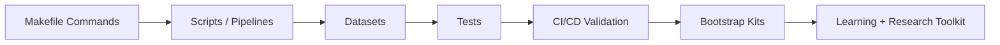

# Research & Learning Toolkit

A modular toolkit for **research management** and **active learning**.  
It provides a structured way to ingest, transform, and explore research assets — textbooks, blog posts, academic papers, videos, audio, and personal notes — while keeping everything reproducible and extensible.

---

## 🚀 Features

- **Bootstrap kits**: Generate starter projects with examples, tests, and documentation.
- **Ingest pipelines**: Scripts to normalize data from multiple sources (CSV, JSON, transcripts, blogs, etc).
- **Learning dashboard**: Unified views for progress tracking, notes, and evidence logs.
- **Testing harness**: Reusable test runner in both JS and Python lanes.
- **CI-ready workflows**: Node-based GitHub Actions configured for build + test.

---

## 📂 Repository Structure

```
.
├── bootstrap/          # Generated kits (scaffolded research/learning modules)
├── scripts/            # Bootstrap + ingest scripts
│   ├── bootstrap/      # Modular bootstrap scripts
│   ├── ingest/         # Ingest pipelines for different asset types
│   └── utils/          # Shared helpers
├── datasets/           # Example datasets (CSV, transcripts, etc.)
├── tests/              # Test files for pipelines + datasets
├── .github/workflows/  # CI configuration
├── Makefile            # Entry points for developer workflows
├── package.json        # Node dependencies + entry points
└── README.md           # You are here
```

---

## 🛠 Make Command Reference

### Bootstrap & Build

- `make bootstrap`  
  Bootstraps all kits using `npm run kits:build`. Creates scaffolds under `bootstrap/`.

- `make build`  
  Installs dependencies and builds all modular scripts.

---

### Testing & Linting

- `make test`  
  Runs all tests (JS + Py lanes).

- `make lint`  
  Runs ESLint and Prettier across the repo.

- `make clean`  
  Cleans generated outputs and resets state.

---

### Ingest Pipelines

- `make ingest-sample`  
  Run the example CSV/JSON ingest pipeline.

- `make ingest-transcripts`  
  Import transcripts (e.g., video or audio sources) into normalized form.

---

### CI / Automation

- `make ci`  
  Runs the same workflow locally as in GitHub Actions (`node.yml`).

- `make ci-test`  
  CI-safe test runner (mirrors `run-py` / `run-js` behavior in CI).

---

### Developer Utilities

- `make watch`  
  Watch mode for scripts (auto-reruns on changes).

- `make log-tail`  
  Tails the latest evidence log in real time.

- `make format`  
  Formats codebase using Prettier.

---

## 🔍 Example Pipelines

### System Pipeline

```mermaid
flowchart TD
    A[Research Assets] -->|Books, Blogs, Audio, Video, Notes| B[Ingest Pipelines]
    B --> C[Datasets (CSV, JSON, Normalized Data)]
    C --> D[Learning Dashboard]
    D --> E[Evidence Logs & Summaries]
    E --> F[Research Outputs: Papers, Books, Blogs]
```

## 

### Developer Workflow



## 

## 🧩 Extending the System

This repo is designed to grow with your research project. Examples:

1. **Add a new tool**  
   Place under `scripts/utils/` and wire it into `bootstrap_all_kits.mjs`.

2. **Add a new dataset**  
   Drop files into `datasets/` and create a matching ingest under `scripts/ingest/`.

3. **Add a new research ingest (blogs, notes, etc.)**  
   Copy one of the existing ingest pipelines and modify source-specific logic.

4. **Add CI checks**  
   Extend `.github/workflows/node.yml` to run your new pipelines/tests.

---

## 📖 Example Usage

1. Collect a new dataset (say, a CSV of blog posts).
2. Write an ingest under `scripts/ingest/blog_import.mjs`.
3. Run it with `make ingest-blogs`.
4. Extend your research kit with a dashboard entry (`make bootstrap`).
5. Push changes — CI validates build + tests.

---

## 🎓 How This Toolkit Supports Learning & Research

- **For Learning**  
  Turn textbooks, videos, and Bear notes into structured study kits.  
  Summarize, create practice questions, and track progress with reproducible pipelines.

- **For Research**  
  Ingest diverse sources (blogs, transcripts, audio, datasets).  
  Normalize them into reusable formats.  
  Produce evidence logs and annotated datasets that can be cited in papers, blogs, or books.

- **For Book Writing**  
  Example: Collect blog posts, videos, and your notes on a subject → ingest them → generate summaries and structured kits → use those outputs as raw material for your manuscript.

---

## ✅ Benefits Over a Monolith

- **Separation of concerns**: Each script is small, composable, and testable.
- **Reproducibility**: CI ensures that datasets and pipelines remain valid.
- **Extensibility**: Add new ingests or tools without breaking existing ones.
- **Scalability**: Move from learning projects to publishable research with the same toolkit.
