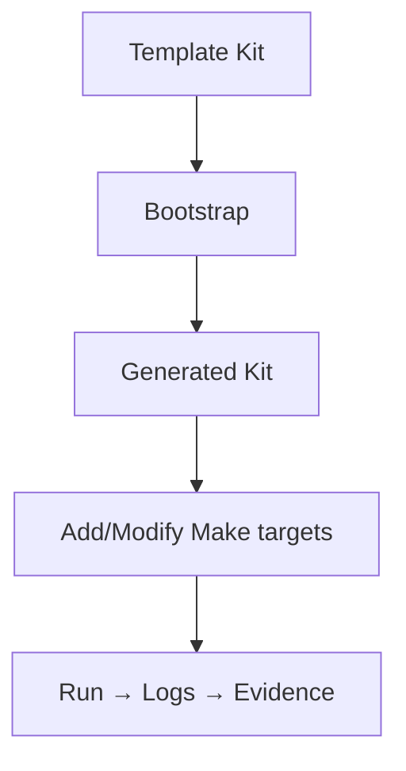

# Extending the System

How to add kits, targets, and tools — with runnable examples.

## Extension Flow



## Add a New Kit

```bash
# At repo root
node scripts/bootstrap/index.mjs --kits MyNewKit --out . --force
```

You get `MyNewKit_NODEONLY/` with guarded Makefile, notes, logs, tools, assets, tests.

## Add a New Tool + Target

1. Create `tools/json_filter_to_csv.mjs` (functional script).
2. Add Make target:

```make
json-filter-to-csv: ## Filter JSONL (FILE=…, KEY=…, VALUE=…) → out.csv
	@$(MAKE) .ensure-kit
	@node tools/json_filter_to_csv.mjs --file "$(FILE)" --key "$(KEY)" --value "$(VALUE)" > out.csv
	@echo "Wrote out.csv"
```

Run:

```bash
make json-filter-to-csv FILE=assets/metadata/references_index.jsonl KEY=type VALUE=book
```

## Change Defaults (entry points)

Temporary:

```bash
make run-js JS_FILE=assets/code/my_demo.mjs
```

Permanent (kit Makefile):

```make
JS_FILE ?= assets/code/my_demo.mjs
```

## Tests

- JS: `tests/run_tests.mjs` (Node only, no deps).
- PY: `tests/run_tests_py.py` (only runs if python3 exists).

## Debugging

- `missing separator` → ensure recipe lines start with **TAB**.
- No Evidence row → verify `logs/run_*.log` exists and path passed to `append_evidence_row.mjs`.
- Quick CSV from JSONL → `node tools/json_to_csv.mjs --file assets/metadata/*.jsonl > out.csv`.

Cross-links:

- [Reference](./REFERENCE.md) · [Philosophy](./PHILOSOPHY.md) · [Glossary](./GLOSSARY.md)

```

```
