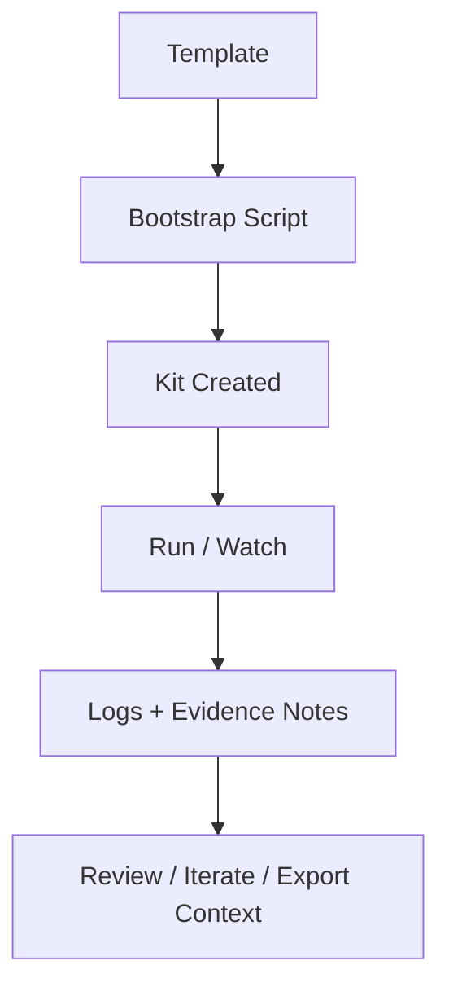

# Philosophy of Use

This system is built around **kits**: independent, reproducible workspaces for learning and research. Each kit contains code, data, logs, and a human-readable **Evidence Log**.

## Core Principles

1. **Isolation** — each experiment lives in its own kit.
2. **Repeatability** — bootstrap writes the same structure every time.
3. **Traceability** — every run produces a log row in the Evidence Log.
4. **Simplicity** — Makefiles for orchestration; small Node scripts for work.
5. **Context export** — `pack-context` ships curated notes/metadata for LLM tools.

## Kit Lifecycle



> A kit is a “research notebook page” you can regenerate and share.

See also: [Glossary](./GLOSSARY.md)

```


```
