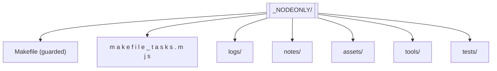
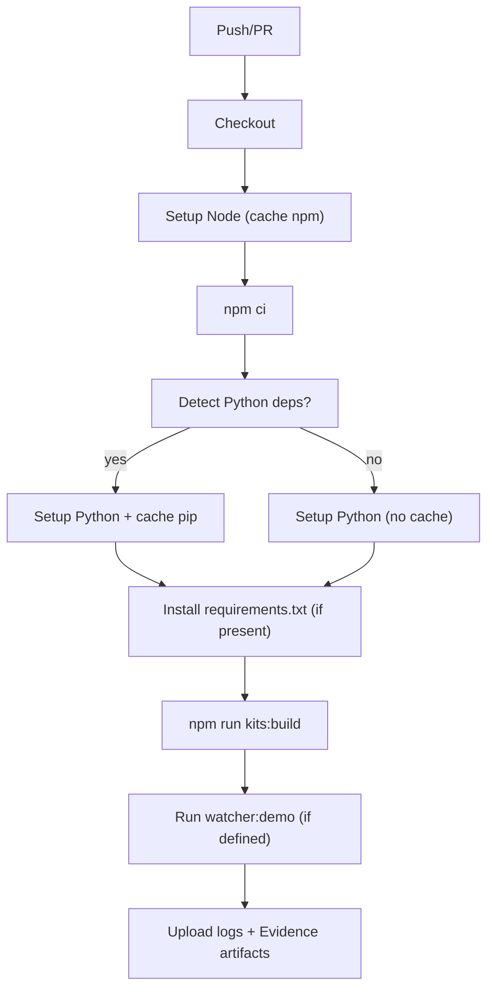

# Developer Reference

A deep dive into how the code and workflows fit together.

## Repository Map

- `scripts/bootstrap/…` — kit generators + templates
- `scripts/ci/…` — CI helpers (optional watcher)
- `<KIT>_NODEONLY/` — generated kits (Makefile, tools, notes, logs, assets, tests)
- `.github/workflows/node.yml` — CI pipeline
- `package.json` — npm aliases for Make targets

## Kit Anatomy

- **Makefile** — guards + targets (run/watch/tests/ingest/pack).
- **makefile_tasks.mjs** — functional wrappers (no guards).
- **tools/** — small Node utilities (watcher, evidence row appender, json→csv, ingest).
- **assets/** — data, code, transcripts, images.
- **notes/** — evidence & dashboards.
- **logs/** — run\_\*.log files.

## CI Workflow

Artifacts uploaded:

- `*/logs/**/*.log`
- `*/notes/*EvidenceLog.md`

## Technical Notes

- **Make guards** create dirs and seed Evidence headers before every target.
- **Every run** writes to `logs/run_*.log` and appends a single Evidence row.
- **Node-first**: all utilities are plain `.mjs` scripts (no deps).
- **Optional Python** lane is harmless if not used; CI enables it only when needed.

Cross-links:

- [Philosophy](./PHILOSOPHY.md) · [Extending](./EXTENDING.md) · [Glossary](./GLOSSARY.md)
